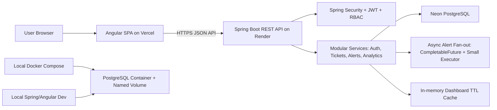

# TicketFlow

TicketFlow is a production-style incident ticketing platform built with an Angular frontend, Spring Boot/Spring MVC REST API, JWT role-based security, PostgreSQL persistence, async alert workflows, and dashboard analytics.

The project is structured as a deployable monorepo:

- Frontend: Angular static app for Vercel
- Backend: Spring Boot web service for Render
- Database: external PostgreSQL on Neon
- Local development: Docker Compose PostgreSQL, optional backend/frontend containers, and H2 demo profile

## Architecture



More detail: [docs/ARCHITECTURE.md](docs/ARCHITECTURE.md).

## Tech Stack

| Layer | Tools |
| --- | --- |
| Frontend | Angular, TypeScript, Angular Router, Reactive Forms, HttpClient, CSS |
| Backend | Java 17, Spring Boot 3, Spring MVC, Spring Security, Spring Data JPA, Bean Validation |
| Persistence | PostgreSQL, Neon, H2 for quick local demo, Flyway migrations, Hibernate/JPA |
| Async/Analytics | CompletableFuture, small ExecutorService/Spring executor, Java Streams, Collections, ConcurrentHashMap TTL cache |
| Testing | JUnit 5, Mockito, Spring Security Test, MockMvc, Maven Surefire |
| Local Dev | Docker Compose, PostgreSQL 16 Alpine, optional backend/frontend Dockerfiles |
| Deployment | Render Web Service, Vercel, Neon PostgreSQL |

## Features

- JWT authentication with register, login, logout, and current-user flow
- Role-based access control for `ADMIN`, `AGENT`, and `CUSTOMER`
- Ticket creation, listing, filtering, pagination, detail view, status updates, assignment, and comments
- SLA due-date calculation by priority: urgent, high, medium, low
- Async alerts for assignment, status change, and comments
- Alert inbox with mark-one-read and mark-all-read actions
- Dashboard summary with ticket counts, overdue SLA count, priority/status grouping, agent workload, and average resolution time
- In-memory dashboard cache with invalidation on ticket mutations
- Seed data for realistic portfolio demo workflows
- Local Docker PostgreSQL setup and optional full-stack Docker profile
- Production-oriented Render/Vercel/Neon deployment docs

## Screenshots

Screenshots can be added under `docs/screenshots/` as the UI is finalized.

Suggested placeholders:

- Dashboard summary
- Ticket list with filters
- Ticket detail with comments and admin actions
- Alerts inbox

## Repository Layout

```text
ticketflow/
  backend/                 Spring Boot / Spring MVC API
  frontend/                Angular client for Vercel
  docs/                    Architecture, setup, API, and deployment docs
  docker-compose.yml       Local development services only
  AGENTS.md                Contributor and agent guide
  README.md                Project overview
```

## Local Setup

### Backend With H2

```bash
cd backend
mvn spring-boot:run -Dspring-boot.run.profiles=dev
```

With demo seed data:

```bash
cd backend
mvn spring-boot:run -Dspring-boot.run.profiles=dev -Dspring-boot.run.arguments=--app.seed.enabled=true
```

Health check:

```bash
curl http://localhost:8080/api/health
```

### Frontend

```bash
cd frontend
npm install
NG_APP_API_URL=http://localhost:8080/api npm run build
npm start
```

Open:

```text
http://127.0.0.1:4200
```

### Docker PostgreSQL

From the repository root:

```bash
docker compose up -d postgres
```

If port `5432` is busy:

```bash
POSTGRES_PORT=15432 docker compose up -d postgres
```

Run backend against Docker PostgreSQL:

```bash
cd backend
SPRING_PROFILES_ACTIVE=docker \
DATABASE_URL=jdbc:postgresql://localhost:5432/ticketflow \
DATABASE_USERNAME=ticketflow \
DATABASE_PASSWORD=ticketflow_dev_password \
JWT_SECRET=local-dev-placeholder-not-a-real-secret-change-me-32chars \
ALLOWED_ORIGINS=http://localhost:4200,http://127.0.0.1:4200 \
APP_SEED_ENABLED=true \
mvn spring-boot:run
```

Full local Docker stack:

```bash
docker compose --profile stack up --build
```

More detail: [docs/DOCKER_SETUP.md](docs/DOCKER_SETUP.md).

## Deployment Setup

| Target | Guide | Key Settings |
| --- | --- | --- |
| Render backend | [docs/RENDER_DEPLOYMENT.md](docs/RENDER_DEPLOYMENT.md) | Root `backend`, build `mvn clean package -DskipTests`, start `java -Xmx384m -jar target/*.jar` |
| Vercel frontend | [docs/VERCEL_DEPLOYMENT.md](docs/VERCEL_DEPLOYMENT.md) | Root `frontend`, output `dist/ticketflow-frontend/browser`, env `NG_APP_API_URL` |
| Neon PostgreSQL | [docs/NEON_SETUP.md](docs/NEON_SETUP.md) | External PostgreSQL JDBC URL, username, and password |

Use [DEPLOYMENT_CHECKLIST.md](DEPLOYMENT_CHECKLIST.md) before publishing a demo build.

Docker is for local development only. Production deployment does not require Docker, Render disks, local file storage, Redis, RabbitMQ, Kafka, or Elasticsearch.

## Demo Users

Seed data runs only when `APP_SEED_ENABLED=true` or `app.seed.enabled=true`.

| Role | Email | Password |
| --- | --- | --- |
| Admin | `admin@ticketflow.dev` | `password123` |
| Agent | `agent@ticketflow.dev` | `password123` |
| Agent | `agent2@ticketflow.dev` | `password123` |
| Customer | `customer@ticketflow.dev` | `password123` |

More detail: [docs/SEED_USERS.md](docs/SEED_USERS.md).

## API Summary

| Area | Endpoints |
| --- | --- |
| Health | `GET /api/health` |
| Auth | `POST /api/auth/register`, `POST /api/auth/login`, `GET /api/auth/me` |
| Tickets | `POST /api/tickets`, `GET /api/tickets`, `GET /api/tickets/{id}`, `PATCH /api/tickets/{id}/status`, `PATCH /api/tickets/{id}/assign` |
| Comments | `POST /api/tickets/{id}/comments`, `GET /api/tickets/{id}/comments` |
| Alerts | `GET /api/alerts`, `PATCH /api/alerts/{id}/read`, `PATCH /api/alerts/read-all` |
| Dashboard | `GET /api/dashboard/summary` |

Full request/response examples: [docs/API.md](docs/API.md).

## Testing Commands

Backend:

```bash
cd backend
mvn test
mvn clean package -DskipTests
```

Frontend:

```bash
cd frontend
npm install
NG_APP_API_URL=http://localhost:8080/api npm run build
```

Docker:

```bash
docker compose config
docker compose up -d postgres
docker compose ps
```

## Resume Bullets

TicketFlow Cloud | Java, Spring Boot, Spring MVC, Angular, PostgreSQL, Docker, Render, Vercel
- Built a cloud-deployed incident ticketing platform with Angular UI and Spring Boot/Spring MVC REST APIs for JWT auth, RBAC, ticket CRUD, SLA tracking, filtering, pagination, and PostgreSQL persistence.
- Designed modular Java services for tickets, users, alerts, and analytics using JPA/Hibernate, Java Streams, CompletableFuture, thread-safe Collections, global exception handling, seed data, and Docker-based local setup.

## Known Limitations

- The app is a portfolio demo, not a fully hardened production incident-management suite.
- There is no password reset, email verification, or third-party identity provider integration yet.
- Admin assignment dropdown is derived from known agent workload/demo data instead of a dedicated user-management API.
- Alerts are persisted and generated asynchronously in-process, but there is no external notification provider.
- Dashboard caching is in-memory per backend instance; it is intentionally lightweight and not shared across multiple instances.
- File uploads and local filesystem persistence are intentionally excluded.
- The frontend stores JWTs in local storage for simplicity in the demo.
