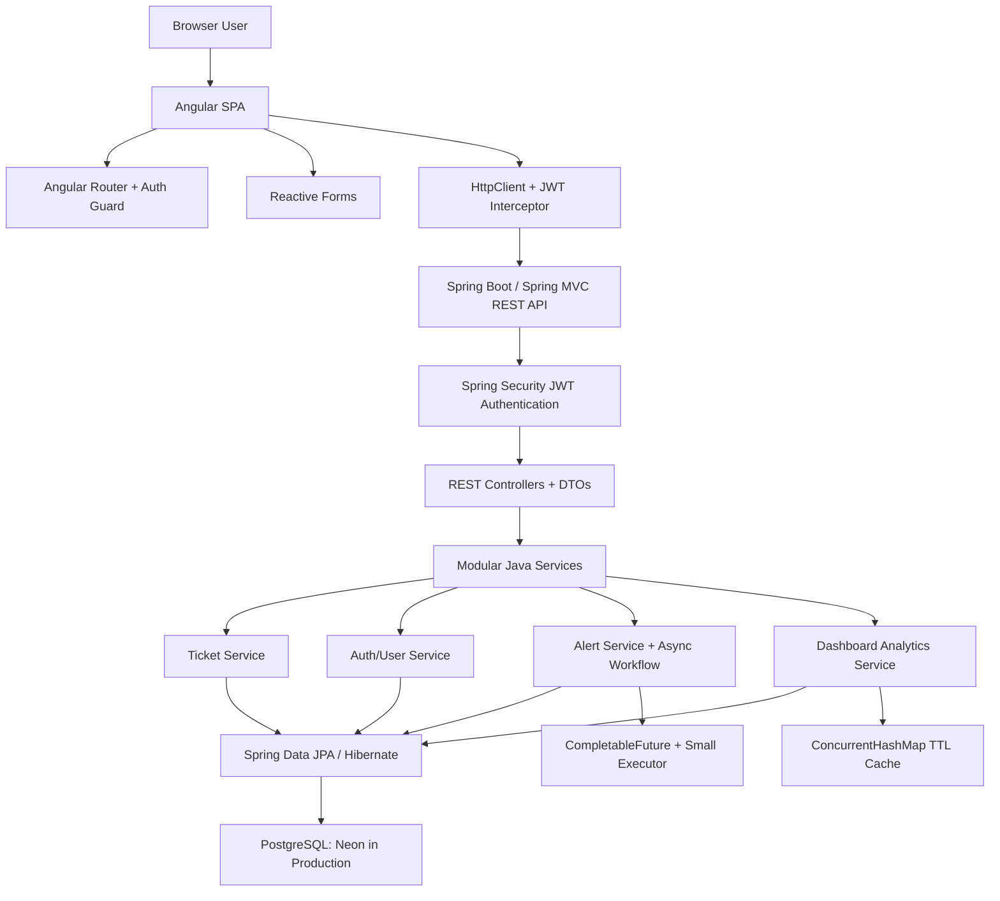
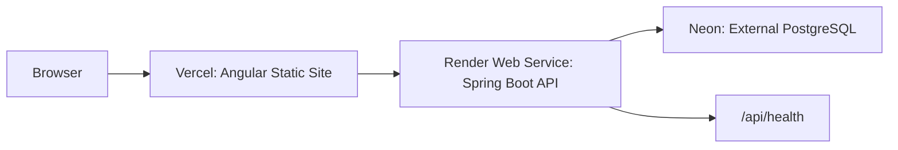

# TicketFlow Architecture

TicketFlow is a Java full-stack incident ticketing platform designed for a small cloud deployment: Angular on Vercel, Spring Boot on Render, and PostgreSQL on Neon.

## System Diagram

## Angular Frontend

The frontend lives in `frontend` and is built as an Angular single-page application.

Responsibilities:

- Route users through `/login`, `/register`, `/dashboard`, `/tickets`, `/tickets/new`, `/tickets/:id`, and `/alerts`.
- Protect authenticated routes with an auth guard.
- Store the JWT after login/register and attach it through an HTTP interceptor.
- Render role-aware UI for customers, agents, and admins.
- Use Reactive Forms for auth, ticket creation, ticket filters, status updates, assignment, and comments.
- Read `window.__env.API_BASE_URL` from `src/assets/env.js`, generated by `scripts/generate-env.js`.

Vercel serves the Angular build output from `dist/ticketflow-frontend/browser`, with `vercel.json` rewriting SPA routes to `index.html`.

## Spring Boot REST API

The backend lives in `backend` and exposes REST APIs under `/api`.

Main modules:

- `auth`: register, login, current user, JWT generation/validation.
- `user`: user entity, role enum, repository.
- `ticket`: tickets, comments, filtering, assignment, status transitions, SLA logic.
- `alert`: alert persistence, alert endpoints, async alert workflow.
- `analytics`: dashboard aggregation and cache.
- `common`: health endpoint, page response DTO, global exception handling.
- `seed`: optional demo data.

Controllers return DTOs instead of exposing JPA entities directly.

## Spring Security JWT Auth

Spring Security protects all `/api/**` routes except auth endpoints and health checks.

Rules:

- Public: `POST /api/auth/register`, `POST /api/auth/login`, `GET /api/health`, actuator health.
- Authenticated: all other API routes.
- Customer: create tickets and view their own tickets.
- Agent: view and update assigned tickets.
- Admin: view and manage all tickets and users.

JWT tokens are signed with `JWT_SECRET`, which must be provided in production.

## PostgreSQL Persistence

Persistent data lives in PostgreSQL for production and Docker local development.

Tables:

- `users`
- `tickets`
- `ticket_comments`
- `alerts`
- `flyway_schema_history`

Spring Data JPA repositories handle persistence. Hibernate validates the schema in `prod`, while Flyway applies migrations first. The H2 `dev` profile remains available for quick local demos.

The backend does not persist application data to the local filesystem.

## Async Alerts

Ticket mutations trigger alert workflow events:

- Assignment alerts for agents.
- Status-change alerts for customers.
- Comment alerts for other relevant users.

The alert workflow uses `CompletableFuture` with a small Spring-managed executor. Alerts are persisted in PostgreSQL; there is no Redis, RabbitMQ, Kafka, or external worker requirement.

The executor is deliberately small and configurable to keep the backend suitable for a lightweight Render Web Service.

## Dashboard Analytics

`DashboardAnalyticsService` aggregates ticket data for the dashboard:

- Total tickets
- Open, in-progress, resolved, and closed counts
- Overdue SLA count
- Tickets grouped by priority
- Tickets grouped by status
- Agent workload summary
- Average resolution time in hours

The implementation uses Java Streams, Collections, grouping operations, and simple DTO mapping.

## In-Memory Dashboard Caching

Dashboard summaries are cached in a thread-safe in-memory TTL cache backed by `ConcurrentHashMap`.

Cache behavior:

- Scoped by role/user visibility.
- Short TTL configured by `ticketflow.dashboard.cache-ttl-seconds`.
- Invalidated when ticket data changes.

This avoids external cache infrastructure while keeping repeated dashboard reads lightweight.

## Deployment Architecture

Production deployment:

- Frontend: Vercel
- Backend: Render Web Service
- Database: Neon PostgreSQL

Local development:

- H2 for quick backend demos.
- Docker Compose PostgreSQL for local database parity.
- Optional Docker backend/frontend stack for local integration testing.

Docker is local-only and is not required for Render, Vercel, or Neon deployment.
